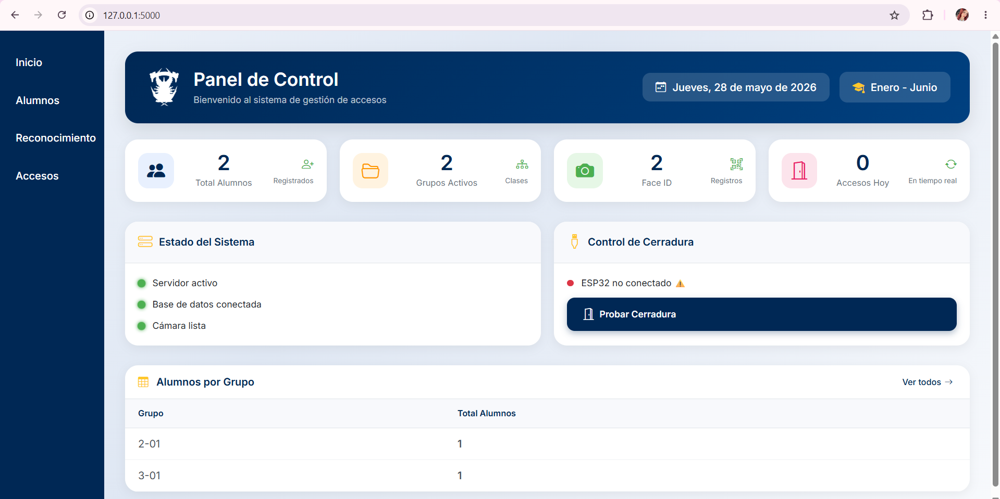
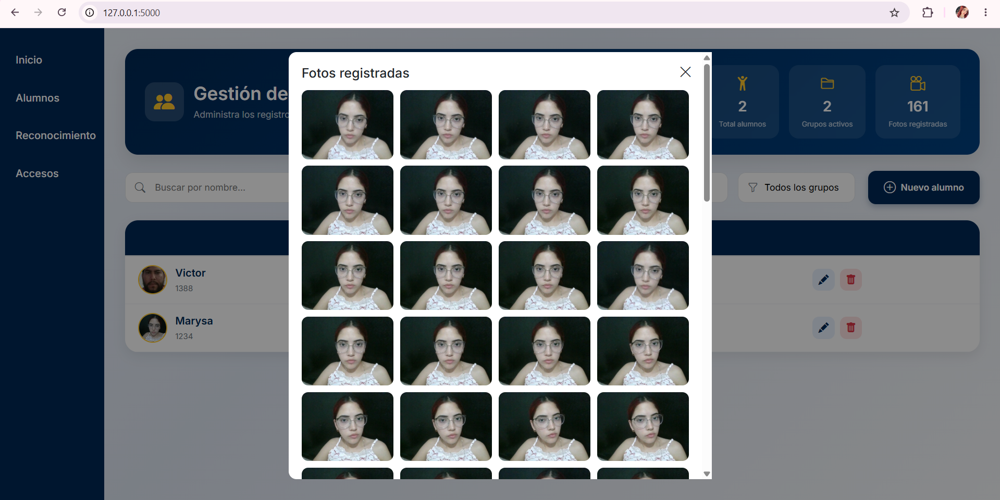
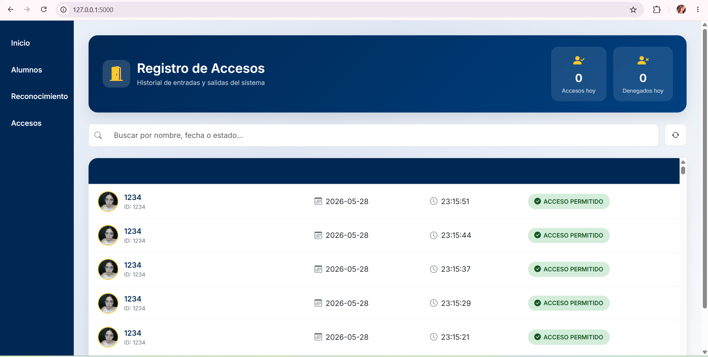

# Sistema Inteligente de Control de Accesos mediante Reconocimiento facial e IoT

Proyecto universitario desarrollado para el control de acceso mediante reconocimiento facial utilizando inteligencia artificial, visión por computadora y comunicación con ESP32.

# Descripción

El sistema permite detectar y reconocer rostros en tiempo real mediante una cámara web, validando usuarios registrados y permitiendo la apertura automática de una cerradura electrónica.

También incluye una interfaz web para la administración y monitoreo de accesos.

# Tecnologías utilizadas

HTML5

CSS3

Bootstrap Icons

Google Fonts

Chart.js

JavaScript

Fetch API

Canvas API

MediaDevices API

Python

Flask

OpenCV 

DeepFace

NumPy

Requests

threading / queue

datetime

serial 

MySQL

ESP32 

Cámara web

# Funciones principales

✅ Reconocimiento facial en tiempo real  
✅ Registro de usuarios  
✅ Apertura automática mediante ESP32  
✅ Historial de accesos  
✅ Interfaz web interactiva  
✅ Entrenamiento de rostros  

# Capturas del sistema

## Pantalla principal

## Cámara y reconocimiento

## Reconocimiento facial

## Historial del sistema

# Código de muestra

El repositorio incluye únicamente partes demostrativas del proyecto.

Algunos archivos incluidos:
- reconocimiento.py
- entrenar.py
- conexión con ESP32
- interfaz principal

# Nota importante

Este repositorio contiene únicamente una versión demostrativa del proyecto con fines académicos.

No se incluyen modelos completos, bases de datos ni archivos sensibles.

# Autor

Marysa Quiñónez Chavez
Carolina Vazquez Robles
Diego Alejandro Arevalo
Mia Yolanda Rios Ramirez

© 2026 Todos los derechos reservados.
